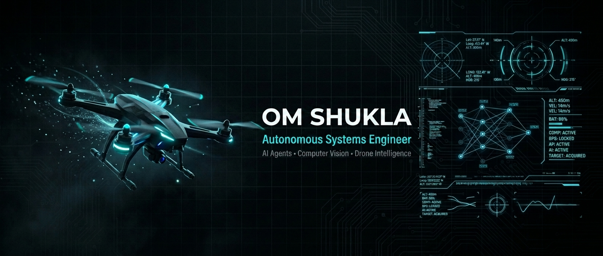

<!-- ═══════════════════════════════════════════════════════════════════════════
     OM SHUKLA — GitHub Profile README
     Autonomous Systems Engineer | AI Agents | Computer Vision | Drone Intelligence
     ═══════════════════════════════════════════════════════════════════════════ -->

<div align="center">

<!-- ▓▓▓▓▓▓▓▓▓▓▓▓▓▓▓▓▓▓▓▓▓▓▓ HERO BANNER ▓▓▓▓▓▓▓▓▓▓▓▓▓▓▓▓▓▓▓▓▓▓▓ -->



<!-- ▓▓▓▓▓▓▓▓▓▓▓▓▓▓▓▓ ANIMATED SVG HEADER ▓▓▓▓▓▓▓▓▓▓▓▓▓▓▓▓ -->



<br/>

<!-- ▓▓▓▓▓▓▓▓▓▓▓▓▓▓▓▓ TYPING ANIMATION ▓▓▓▓▓▓▓▓▓▓▓▓▓▓▓▓ -->

<p align="center">
  <a href="https://github.com/omshukla001">
    
  </a>
</p>

<!-- Quick identity badges -->
<p align="center">
  
  
</p>


</div>

<!-- ═══════════════════════════════════════════════════════════════════════════
     ABOUT ME — TERMINAL STYLE
     ═══════════════════════════════════════════════════════════════════════════ -->

##  &nbsp;`System.init()`

```bash
╭──────────────────────────────────────────────────────────────────────────────╮
│                                                                              │
│   ██████╗ ███╗   ███╗    ███████╗██╗  ██╗██╗   ██╗██╗  ██╗██╗      █████╗   │
│  ██╔═══██╗████╗ ████║    ██╔════╝██║  ██║██║   ██║██║ ██╔╝██║     ██╔══██╗  │
│  ██║   ██║██╔████╔██║    ███████╗███████║██║   ██║█████╔╝ ██║     ███████║  │
│  ██║   ██║██║╚██╔╝██║    ╚════██║██╔══██║██║   ██║██╔═██╗ ██║     ██╔══██║  │
│  ╚██████╔╝██║ ╚═╝ ██║    ███████║██║  ██║╚██████╔╝██║  ██╗███████╗██║  ██║  │
│   ╚═════╝ ╚═╝     ╚═╝    ╚══════╝╚═╝  ╚═╝ ╚═════╝ ╚═╝  ╚═╝╚══════╝╚═╝  ╚═╝  │
│                                                                              │
╰──────────────────────────────────────────────────────────────────────────────╯
```

```js
> om.whoami()
```

<details open>
<summary><b>👨‍💻 View Developer Profile (Click to Collapse)</b></summary>

```yaml
Name:       Om Shukla
Role:       Autonomous Systems & AI Engineer
Location:   Bangalore, India 🇮🇳

Mission:    "Building next-generation intelligent systems that bridge 
             the gap between AI and the physical world—spanning 
             autonomous drones, RAG pipelines, facial biometrics, 
             and workflow automation."

Core Focus:
  - 🛸 Drone Systems (ArduPilot, Pixhawk, Autonomy)
  - 🧠 Advanced AI & NLP (RAG Pipelines, LLaMA/Cerebras)
  - 👁️ Computer Vision (YOLOv8, DeepFace Biometrics)
  - ⚡ Automation (WhatsApp Lead Bots, Workflow tools)
```
</details>

<div align="center">

</div>

<!-- ═══════════════════════════════════════════════════════════════════════════
     CORE EXPERTISE
     ═══════════════════════════════════════════════════════════════════════════ -->

##  &nbsp;Cross-Domain Expertise

<div align="center">

<table>
<tr>
<td align="center" width="250">

**🛸 Autonomous Drones & Robotics**
<br/>
<details><summary><i>View Tech Stack</i></summary>
<sub>Navigation · Path Planning · Autonomy · MAVLink · ArduPilot · Pixhawk · Raspberry Pi</sub>
</details>

</td>
<td align="center" width="250">

**🧠 AI Agents & NLP (RAG)**
<br/>
<details><summary><i>View Tech Stack</i></summary>
<sub>LLM Pipelines · RAG Integration · FAISS · LangChain · LLaMA/Cerebras · Semantic Search</sub>
</details>

</td>
</tr>
<tr>
<td align="center" width="250">

**👁️ Computer Vision & Biometrics**
<br/>
<details><summary><i>View Tech Stack</i></summary>
<sub>YOLOv8 · OpenCV · DeepFace · Facial Recognition · Object Tracking · PyTorch</sub>
</details>

</td>
<td align="center" width="250">

**⚡ Automation & Chatbots**
<br/>
<details><summary><i>View Tech Stack</i></summary>
<sub>WhatsApp Baileys · Termux APIs · Node.js Automation · Web Scraping · System Architecture</sub>
</details>

</td>
</tr>
</table>

</div>

<div align="center">

</div>

<!-- ═══════════════════════════════════════════════════════════════════════════
     FEATURED PROJECTS
     ═══════════════════════════════════════════════════════════════════════════ -->

## 🚀 &nbsp;Featured Engineering Projects

<div align="center">

<details open>
<summary><h3>🛸 <b>Domain 1: Robotics & Hardware</b></h3></summary>

<br/>

<a href="https://github.com/omshukla001/NIDAR">

</a>

<table>
<tr>
<td width="70" align="center"><br/>🚁</td>
<td>

### NIDAR — Autonomous Dual-Drone Disaster Management System

> *Real-world autonomous dual-drone system engineered for active flood rescue operations.*

**Architecture Flow:**
- 🔍 **Scout Drone** — Detects stranded humans via YOLOv8, extracts GPS coordinates autonomously.
- 📦 **Delivery Drone** — Receives telemetry, navigates to victims, drops emergency payloads via MAVLink.

<details><summary><b>⚙️ View Tech Stack & Implementation</b></summary>
<br/>
<p>
  
  
  
  
  
</p>
<blockquote>
  Engineered closed-loop communication between two autonomous agents. Integrated hardware (Pixhawk) with AI edge-computing (Raspberry Pi + YOLO).
</blockquote>
</details>
</td>
</tr>
</table>

</details>

<br/>

<details open>
<summary><h3>🧠 <b>Domain 2: RAG Pipelines & Applied AI</b></h3></summary>

<br/>

<table>
<tr>
<td width="70" align="center"><br/>🎓</td>
<td>

### CounsellorWala — AI College Counselling Platform

> *Intelligent admission prediction and guidance system powered by advanced RAG pipelines.*

**Key Innovations:**
- 🧠 **RAG AI Implementation:** Retrieves and augments final counselling cutoff data to ground LLM responses, eliminating hallucinations.
- 📊 **Prediction Engine:** Rank-to-college matching using FAISS vector search.

<details><summary><b>⚙️ View Tech Stack & Implementation</b></summary>
<br/>
<p>
  
  
  
  
  
</p>
<blockquote>
  Built an end-to-end full stack system handling complex structured and unstructured counselling data to deliver real-time, highly accurate college insights.
</blockquote>
</details>
</td>
</tr>
</table>

</details>

<br/>

<details open>
<summary><h3>⚡ <b>Domain 3: Chatbots & Workflow Automation</b></h3></summary>

<br/>

<table>
<tr>
<td width="70" align="center"><br/>💬</td>
<td>

### WhatsApp Lead Bot — AI Qualification System

> *Local mobile-hosted LLM WhatsApp bot for real-time engineering admissions.*

**Key Innovations:**
- 📱 **Termux + Baileys:** Runs directly on Android using linked-device protocol—no Twilio or APIs needed.
- 🗣️ **Cerebras LLM:** Handles English/Hindi/Hinglish detection and seamless lead qualification.

<details><summary><b>⚙️ View Tech Stack & Implementation</b></summary>
<br/>
<p>
  
  
  
  
</p>
<blockquote>
  Entirely self-hosted phone server architecture routing WhatsApp traffic directly to ultra-fast cloud LLMs.
</blockquote>
</details>
</td>
</tr>
</table>

<table>
<tr>
<td width="70" align="center">🔄</td>
<td>

### AGY Switcher

> *Intelligent automation tool that ensures uninterrupted AI workflows.*

- Auto-detects usage limits and seamlessly shifts contexts across accounts.
</td>
</tr>
</table>

</details>

<br/>

<details open>
<summary><h3>👁️ <b>Domain 4: Computer Vision & Biometrics</b></h3></summary>

<br/>

<table>
<tr>
<td width="70" align="center"><br/>👤</td>
<td>

### Deepface Identifier

> *Facial recognition engine mapping biometric data to identity.*

**Key Innovations:**
- 🖼️ Analyzes faces in real-time or from static imagery.
- 📐 Extracts deep feature embeddings for high-accuracy identity verification.

<details><summary><b>⚙️ View Tech Stack & Implementation</b></summary>
<br/>
<p>
  
  
  
  
</p>
<blockquote>
  Implementation of state-of-the-art face recognition architectures mapping thousands of facial nodes.
</blockquote>
</details>
</td>
</tr>
</table>

</details>
</div>

<div align="center">

</div>


<!-- ═══════════════════════════════════════════════════════════════════════════
     GITHUB STATS
     ═══════════════════════════════════════════════════════════════════════════ -->

## 📊 &nbsp;Mission Telemetry

<div align="center">

<details open>
<summary><b>📈 Click to view GitHub Statistics</b></summary>
<br/>


<br/>


<br/><br/>

<!-- Contribution Graph -->


</details>

</div>

<div align="center">

</div>

<!-- ═══════════════════════════════════════════════════════════════════════════
     GITHUB TROPHIES
     ═══════════════════════════════════════════════════════════════════════════ -->

<div align="center">
<details>
<summary><b>🏆 Click to view GitHub Trophies</b></summary>
<br/>

</details>
</div>

<div align="center">

</div>

<!-- ═══════════════════════════════════════════════════════════════════════════
     CONNECT
     ═══════════════════════════════════════════════════════════════════════════ -->

## 📡 &nbsp;Establish Connection

<div align="center">

<a href="https://github.com/omshukla001">
  
</a>
&nbsp;&nbsp;
<a href="https://linkedin.com/in/omshukla001">
  
</a>
&nbsp;&nbsp;
<a href="mailto:om543shukla@gmail.com">
  
</a>

</div>

<div align="center">

</div>

<!-- ═══════════════════════════════════════════════════════════════════════════
     VISITOR COUNTER & CLOSING
     ═══════════════════════════════════════════════════════════════════════════ -->

<div align="center">


<br/><br/>

```
╔══════════════════════════════════════════════════════════════════════════════╗
║                                                                              ║
║   "The future belongs to those who build the machines that think,            ║
║    the pipelines that retrieve, and the systems that act autonomously."      ║
║                                                                              ║
║                              — Building the future of autonomous intelligence ║
║                                                                              ║
╚══════════════════════════════════════════════════════════════════════════════╝
```

<sub>⚡ Engineered with precision. Deployed with purpose.</sub>

</div>

<!-- ═══════════════════════════════════════════════════════════════════════════
     SNAKE ANIMATION
     ═══════════════════════════════════════════════════════════════════════════ -->

<div align="center">

<picture>
  <source media="(prefers-color-scheme: dark)" srcset="https://raw.githubusercontent.com/omshukla001/omshukla001/output/github-snake-dark.svg" />
  <source media="(prefers-color-scheme: light)" srcset="https://raw.githubusercontent.com/omshukla001/omshukla001/output/github-snake.svg" />
  
</picture>

</div>
